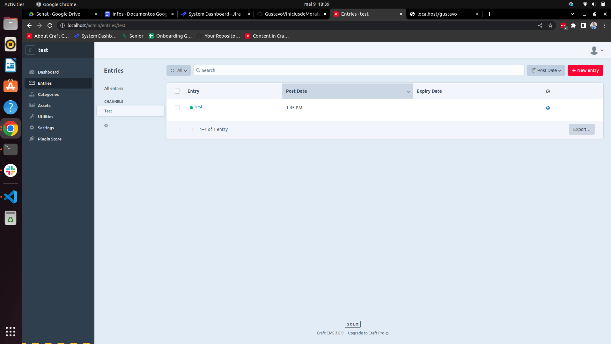
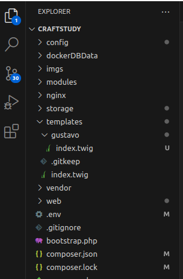
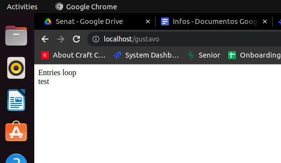

# Basic Craft Explanation

Craft CMS is a framework where you build your data in the
admin panel.
After the data is set in the admin panel, you can read it
in the twig files.
To do this you have to create a folder in the templates folder,
and build an index.twig file inside it. The name of the route
to the page is the name of the folder in the templates directory

### Admin Panel

<br>

### VsCode Folder


### Twig File
In the twig file, you can show the data as show bellow:
```html
# /templates/gustavo/index.twig

<div>Entries loop</div>




    <article>
        {{ entry.title }}
    </article>

```
