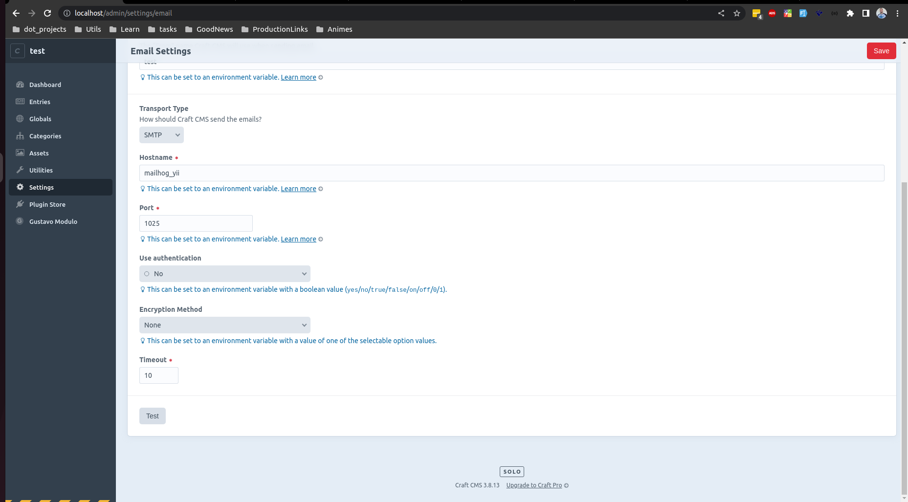

# Config Email Craft

### docker
```yaml
mailhog_yii:
    image: mailhog/mailhog
    container_name: mailhog_yii
    ports:
        - 1025:1025
        - 8025:8025
    networks:
            craft-app-network:
            ipv4_address: 12.0.0.10
```

### ./modules/gustavo/src/frontend/controllers/GustavoController.php
```php
use craft\mail\Message;

class GustavoController extends Controller
{
    public function actionSendEmail()
    {
        $mailer = Craft::$app->getMailer();
        // print_r(json_encode(['mailer'=>$mailer]));echo "\n\n";exit;
        
        $message = new Message();
        $message->setFrom('admin@email.com');
        $message->setSubject('admin@email.com');
        $message->setHtmlBody(\Craft::$app->view->renderTemplate('gustavo/email'));
        $message->setTo('admin@email.com');
        $result = $mailer->send($message);

        print_r(json_encode(['result '=>$result]));echo "\n\n";exit;
    }
}
```

### ./modules/gustavo/src/Gustavo.php
```php
class Gustavo extends \yii\base\Module
{
    public function ini()
    {
        Event::on(
            UrlManager::class,
            UrlManager::EVENT_REGISTER_CP_URL_RULES,
            function (RegisterUrlRulesEvent $event) {
                $event->rules['gustavomp/email'] = $this->id . '/gustavo/send-email';
            }
        );
    }
}
```

```
GET http://localhost/admin/gustavomp/email
```

### Config email settings Craft


```
```